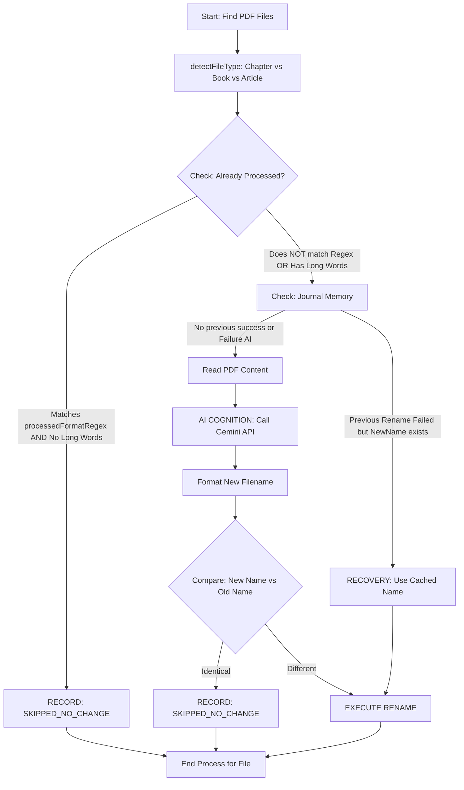

# PROBLEMATIC BEHAVIOR

### Part 1: Behavioral Diagram
The following diagram illustrates how the script currently decides whether to call the Gemini API.



### Part 2: Why it is wasting AI calls
Based on your code, there are three primary reasons why the script is re-processing files:

1.  **Regex Mismatch for Articles:** Your `processedFormatRegex` looks for `Title_Author_Year`. however, your `formatBaseFilename` for **articles** adds `_J-Journal` and `_VVolume`. The regex does not account for these extra underscores, so it thinks the file is "unprocessed."
2.  **Strict "Abnormal Word" Check:** The function `hasAbnormallyLongWord` checks if any word (PascalCase split) is over 20 characters. If a scientific title has a long word (e.g., *“Pathophysiological”*), the script flags it as "broken" and forces a re-analysis.
3.  **Lack of Content Hashing:** The script relies on the *filename* to decide if it's done. If the AI changes its mind slightly on a title (due to temperature or model updates), the filename changes, and the system might get caught in a loop or re-process on the next run.

---

### Part 3: The Fixes

To stop the waste, apply these three changes to your script:

#### Fix 1: Update the Regex
Change the regex in `CONFIG` to be more inclusive of the Article metadata (Journal and Volume).

```typescript
// Replace the old regex with this one:
// It now allows for multiple underscore-separated segments after the year
processedFormatRegex: /^(\d{2,}_)?[^_]+_[^_]+_\d{4}(_[^_]+)*\.pdf$/i,
```

#### Fix 2: Implement a "Pass-Through" Journal Check
Modify `processEntity` to check if the file was **successfully** processed in a previous session by looking at the journal before reading the PDF content.

```typescript
// Inside processEntity (SystemCore class)
const previousAttempt = journalMemory.get(entity.fullPath);

// ADD THIS LOGIC:
if (previousAttempt && previousAttempt.status === 'SUCCESS') {
    logger.info(`Skipping: "${entity.name}" was successfully processed in a previous run.`);
    return null;
}
```

#### Fix 3: Loosen the "Long Word" detector
Scientific and academic titles often contain valid long words. Increase the threshold or exclude specific patterns.

```typescript
// inside hasAbnormallyLongWord
const MAX_WORD_LENGTH = 30; // Increased from 20 to 30
```

#### Fix 4: Content Caching (The "Ultimate" Fix)
Currently, your `NodeCache` isn't being used to skip AI calls. You should store the result of an AI analysis indexed by a hash of the file's first 1000 characters.

1.  **Generate a hash** of the `content.substring(0, 1000)`.
2.  **Check cache:** `if (this.cache.has(hash)) return this.cache.get(hash);`
3.  **Save to cache:** After `cognitionEngine.analyze` succeeds, save the `validatedData` to the cache.

### Summary of required logic change
The most immediate fix to stop the "waste" is to ensure that if a file **already matches the naming pattern**, the script **immediately returns null** without ever calling `entity.readContent()` or `cognitionEngine.analyze()`. Ensure that `looksProcessed` is actually returning `true` for your successfully renamed files by testing your filenames against the regex.